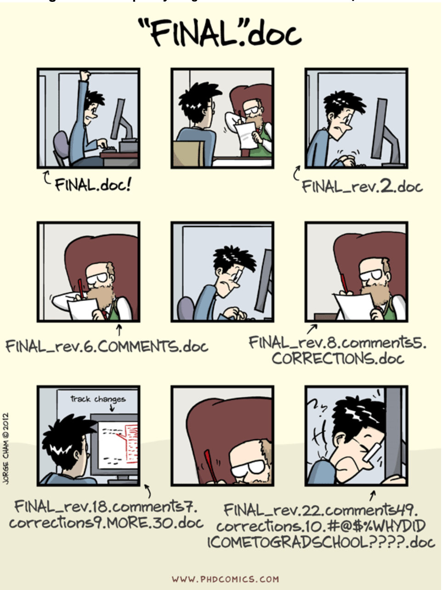

```{r setup, include=FALSE}
options(htmltools.dir.version = FALSE)
knitr::opts_chunk$set(message = FALSE, 
                      echo = FALSE, 
                      warning = FALSE,
                      fig.align = "center")
```

```{r xaringan-themer, include=FALSE, warning=FALSE}
library(xaringanthemer)
style_duo_accent(
  primary_color = "#9F999C",
  secondary_color = "#FFE5F3",
  inverse_header_color = "#8F8C8E",
  link_color = "deeppink",
  title_slide_text_color = "#3d3d3d",
  title_slide_background_image = "img/title-slide-background-light.png",
  title_slide_background_position = "left",
  header_font_google = google_font("Josefin Sans"),
  text_font_google   = google_font("Montserrat", "300", "300i"),
  code_font_google   = google_font("Fira Mono")
)
```

class: center, middle

> *You mostly collaborate with yourself, 
> and me-from-two-months-ago never responds to email.*
> 
> --Mark T. Holder

---

class: center, middle

## What is version control

.pull-left[

<br><br><br>

Version control is the process of keeping a record of changes to documents, including when the changes were made and who made them, throughout the history of their development.

It also provides the means both to view earlier versions of the project and to revert changes.

To version control a project, you generally need two things: a version control system and a repository hosting service. 

]

.pull-right[
```{r phd-comic, out.width="68%"}

```
]

*Source: https://phdcomics.com/comics/archive_print.php?comicid=1531*

---

class: center, middle

## Why should I use it?

*Without deliberate 
and conscious effort towards tracking changes made to an analysis, 
projects tend to become messy*

```{r charlie-day-meme, out.width="50%"}

```

*Source: https://imgflip.com/memegenerator/92459171/Charlie-Day*
---

class: middle

## Why should I use it?


.pull-left[

<br><br><br>

Version control software also facilitates collaboration via tools for:

- sharing edits with others 

- resolving conflicting edits

- democratic communication

- peer review

- project management

]

.pull-right[
```{r bicycle-gif, out.width="55%"}
knitr::include_graphics("img/03-version-control-intro/bicycle-gif.gif")
```
]

*Source: https://giphy.com/gifs/team-work-brocycle-3o6UBbsOZ3co6fJHLG*


---

class: middle

.pull-left[
<br><br><br>

## Version control repositories

Typically, when we put a data analysis project under version control, we create two copies of the repository.
]

.pull-right[
```{r vc1-no-changes, out.width="100%", fig.retina=2}

```
]

---

class: center

## Git versus GitHub

To version control a project, you generally need two things: a version control system (e.g., Git) and a repository hosting service (e.g., GitHub).

```{r git-vs-github, out.width="40%"}
# source: https://www.edureka.co/blog/how-to-use-github/
knitr::include_graphics("img/03-version-control-intro/git-vs-github.png")
```

*Source: https://www.edureka.co/blog/how-to-use-github/*

---

class: middle

.pull-left[
<br><br><br>
## Committing changes to a local repository

When working on files in your local version control 
repository and saving your work, 
these changes will only initially exist in the
working directory of the local repository.
]

.pull-right[
```{r vc2-changes, out.width="100%", fig.retina=2}

```
]

---

class: middle

.pull-left[

## Committing changes to a local repository 

Once you reach a point that you want Git to keep a record 
of the current version of your work, you need to commit 
(i.e., snapshot) your changes. 

A prerequisite to this is telling Git which
files should be included in that snapshot. We call this step *adding* the 
files to the *staging area*. 
]

.pull-right[

```{r vc-ba2-add, out.width="100%", fig.retina=2}

```
]

---

class: middle

.pull-left[
<br>
## Committing changes to a local repository

Once the files we wish to commit have been added 
to the staging area, we can then commit those files to the repository history.

When we do this, we are required to include a helpful *commit message* to tell 
collaborators (which often includes future you!) about the changes that were
made.
]

.pull-right[
```{r vc-ba3-commit, out.width="100%", fig.retina=2}

```
]

---

class: middle

.pull-left[
<br><br><br><br><br>
## Pushing changes to a remote repository

Once you have made one or more commits that you want to share with your collaborators, 
you need to *push* (i.e., send) those commits back to GitHub.

]

.pull-right[
```{r vc5-push, out.width="80%", fig.retina=2}

```
]

---

class: middle

.pull-left[
<br><br><br><br>
## Pulling changes from a remote repository

If you are working on a project with collaborators, 
they will also be making changes to files
(e.g., to the analysis code in a Jupyter notebook and the project's README file),
committing them to their own local repository, 
and pushing their commits to the remote GitHub repository to share them with you. 

When they push their changes, those changes will only initially exist in 
the remote GitHub repository and not in your local repository.
]

.pull-right[
```{r vc6-remote-changes, out.width="100%", fig.retina=2}

```
]

---

class: middle

.pull-left[
<br><br><br><br>
## Pulling changes from a remote repository

To obtain the new changes from the remote repository on GitHub, you will need
to *pull* those changes to your own local repository. 

By pulling changes,
you synchronize your local repository to what is present on GitHub .

Additionally, until you pull changes from the remote repository, 
you will not be able to push any more changes yourself 
(though you will still be able to work 
and make commits in your own local repository). 
]

.pull-right[
```{r vc7-pull, out.width="100%", fig.retina=2}

```
]

---

class: center

## Automatic merging of changes

When collaborating, if different files are changed, 
or even different lines in the same file are changed,
Git can handle this with grace, and can automatically merge such changes.

```{r no-problem, out.width="60%", fig.retina=2}

```

*Source: https://giphy.com/gifs/no-problem-biggie-its-nothing-TfKuJzSVrB9bfaNgQf*

---


.pull-left[

## Merge conflicts! 😱

However when two collaborators change the same line, 
Git throws up its hands and says, I cannot handle this responsbility, 
I need help from a human!

When this happens, your human task is to find the merge conflict markers, 
remove them, and settle on which version of the line(s) 
where the conflict occurred should remain.
]


.pull-right[
```{r sheldon, out.width="100%", fig.retina=2}

```

*Source: https://giphy.com/gifs/the-big-bang-theory-sheldon-cooper-spd8OEUnfXDBS*
]

---

## Merge conflict markers:

- the beginning of the merge conflict is preceded by `<<<<<<< HEAD`

- the end of the merge conflict is marked by `>>>>>>>`

- between the markings mentioned above, Git also inserts a separator (`=======`). The version of the change before the separator is your change, and the version that follows the separator was the change that existed on GitHub.

```{r merge-conflict-identifiers, out.width="80%", fig.retina=2}
knitr::include_graphics("img/03-version-control-intro/merge-conflict-identifiers.png")
```

*Source: https://www2.stat.duke.edu/courses/Fall19/sta199.001/slides/lab-slides/03-lab-slides.html#5*
---

class: center

## Version control summary

```{r vc5-5-nachos-to-cheesecake, out.width="50%", fig.retina=2}
knitr::include_graphics("img/03-version-control-intro/vc5-5-nachos-to-cheesecake.png")
```
---

class: middle

### Knowledge check!

Which of these is untrue about the Git and GitHub version control software?

a. Allows you to view and/or retrieve older snapshots of the files and directories in a project.

b. Automatically snapshots your work every 2 minutes.

c. Provides transparency on who made what changes to files and directories in a document.

d. Can act as a way to back-up your work.

---

class: middle

### Knowledge check!

 GitHub is the software you use locally on your computer (i.e., your laptop) to commit changes to the version control history. True or False?

a. True

b. False

c. Neither true or false.

---

class: middle

### Knowledge check!


You changed two files (notes.txt and eda.ipynb) 
but you only want to commit changes to one of them (eda.ipynb) 
to the version control history. 
Which Git command allows you to specify this?

a. Add

b. Commit

c. Push

d. Push


---

class: middle

### Knowledge check!

At a minimum, how often should you push your work to GitHub?

a. Every 5 min.

b. Every 30 min.

c. At the end of every work session.

d. Once a week.

---

class: middle

### Knowledge check!

You try to push your most recent commit from your locale version control repository to your remote repository on GitHub and it fails because Git says the remote contains work that you have locally. What do should you do next?

a. Commit the changes you made recently in your working directory.

b. Force push your changes.

c. Pull the changes from the remote repository that you do not have locally.

---

class: middle

### Knowledge check!

You pull changes that exist in your remote version control repository on GitHub that you do not have in your local version control repository, and you get the message `Auto-merging in <FILENAME> CONFLICT (content): Merge conflict in <FILENAME> Automatic merge failed; fix conflicts and then commit the result`. What do you need to do?

a. Push the changes from the local repository that you do not have remotely.

b. Force pull the changes.

c. Manually open the file with the conflict and edit it to have the desired version of the changes, as well as remove the special Git syntax used to identify the merge conflict.

---

## Additional Resources

Now that you've picked up the basics of version control with Git and GitHub, 
you can expand your knowledge through the resources listed below:

- GitHub's [guides website](https://guides.github.com/) and [YouTube
  channel](https://www.youtube.com/githubguides), and [*Happy Git and GitHub 
  for the useR*](https://happygitwithr.com/) are great resources to take the next steps in
  learning about Git and GitHub.
- [Good enough practices in scientific
  computing](https://journals.plos.org/ploscompbiol/article?id=10.1371/journal.pcbi.1005510#sec014)
  [@wilson2014best] provides more advice on useful workflows and "good enough"
  practices in data analysis projects.
- In addition to [GitHub](https://github.com), there are other popular Git
  repository hosting services such as [GitLab](https://gitlab.com) and
  [BitBucket](https://bitbucket.org). Comparing all of these options is beyond
  the scope of this book, and until you become a more advanced user, you are
  perfectly fine to just stick with GitHub. Just be aware that you have options!
- GitHub's [documentation on creating a personal access
  token](https://docs.github.com/en/authentication/keeping-your-account-and-data-secure/creating-a-personal-access-token)
  and the *Happy Git and GitHub for the useR* 
  [personal access tokens chapter](https://happygitwithr.com/https-pat.html) are both
  excellent additional resources to consult if you need additional help
  generating and using personal access tokens.

---

class: middle, center

## Attribution

Illustrations of version control steps were derived from
<br>[*Data Science: A First Introduction*](https://datasciencebook.ca/) by Timbers, Campbell & Lee (2022)

```{r ds-a-first-intro-cover, out.width="25%", fig.retina=2}
knitr::include_graphics("img/03-version-control-intro/ds-a-first-intro-cover.jpeg")
```
